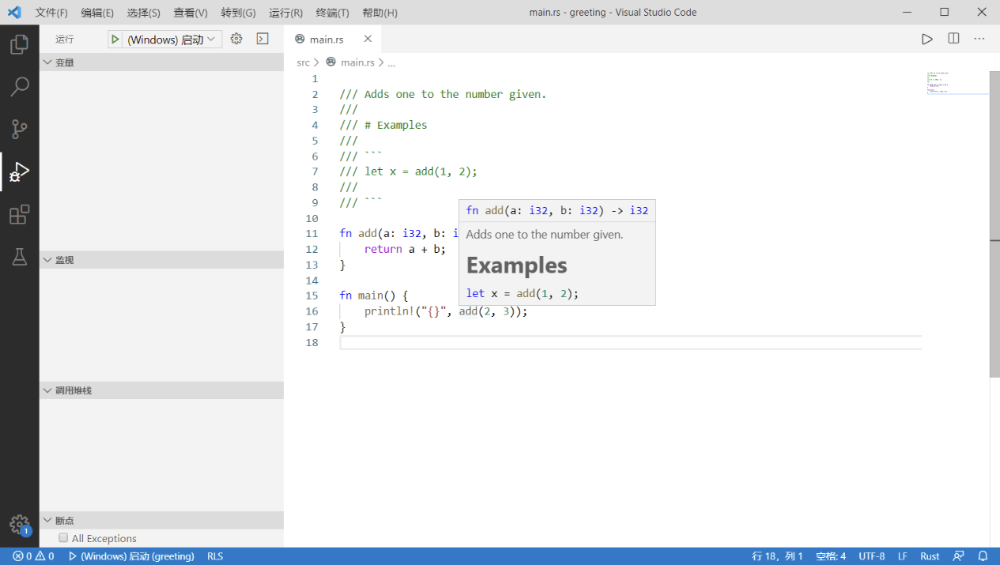

# 注释

开发者在他们的源码中留下**注释**，编译器将会忽略掉这些内容，但阅读源码的人可能会发现有用。

## 普通注释

- `//` 单行注释，注释内容直到行尾。
- `/*` 块注释， 注释内容一直到结束分隔符。 `*/`

```rust
// 这是第一种注释方式
/* 这是第二种注释方式 */
/*
 * 多行注释
 * 多行注释
 * 多行注释
 */
```

```rust
fn main() {
    // 这是行注释的例子
    // 注意这里有两个斜线在本行的开头
    // 在这里面的所有内容编译器都不会读取

    // println!("Hello, world!");

    // 想要运行上述语句？现在请将上述语句的两条斜线删掉，并重新运行。

    /*
     * 这是另外一种格式的注释——块注释。一般而言，行注释是推荐的注释格式，
     * 不过块注释在临时注释大块代码特别有用。/* 块注释可以 /* 嵌套, */ */
     * 所以只需很少按键就可注释掉这些在 main() 函数中的行。/*/*/* 赶紧试试！*/*/*/
     */

     /*
      注意，上面的例子中纵向都有 `*`，这完全是基于格式考虑，实际上这并不是
      必须的。
      */

     // 观察块注释是如何对简单的表达式进行控制，而行注释不能这样操作。
     // 删除注释分隔符将会改变结果。
     let x = 5 + /* 90 + */ 5;
     println!("Is `x` 10 or 100? x = {}", x);
}
```

注释也可以放在包含代码的行后面：

```rust
fn main() {
    let lucky_number = 7; // I’m feeling lucky today
}
```

## 文档注释

其注释内容将被解析成 HTML 帮助文档

在 Rust 中使用 **//** 可以使其之后到第一个换行符的内容变成注释。

在这种规则下，三个反斜杠 **///** 依然是合法的注释开始。所以 Rust 可以用 **///** 作为说明文档注释的开头：

```rust
/// Adds one to the number given.
///
/// # Examples
///
/// ```
/// let x = add(1, 2);
///
/// ```

fn add(a: i32, b: i32) -> i32 {
    return a + b;
}
   
fn main() {
    println!("{}",add(2,3));
}
```

程序中的函数 add 就会拥有一段优雅的注释，并可以显示在 IDE 中：



> Cargo 具有 cargo doc 功能，开发者可以通过这个命令将工程中的说明注释转换成 HTML 格式的说明文档。