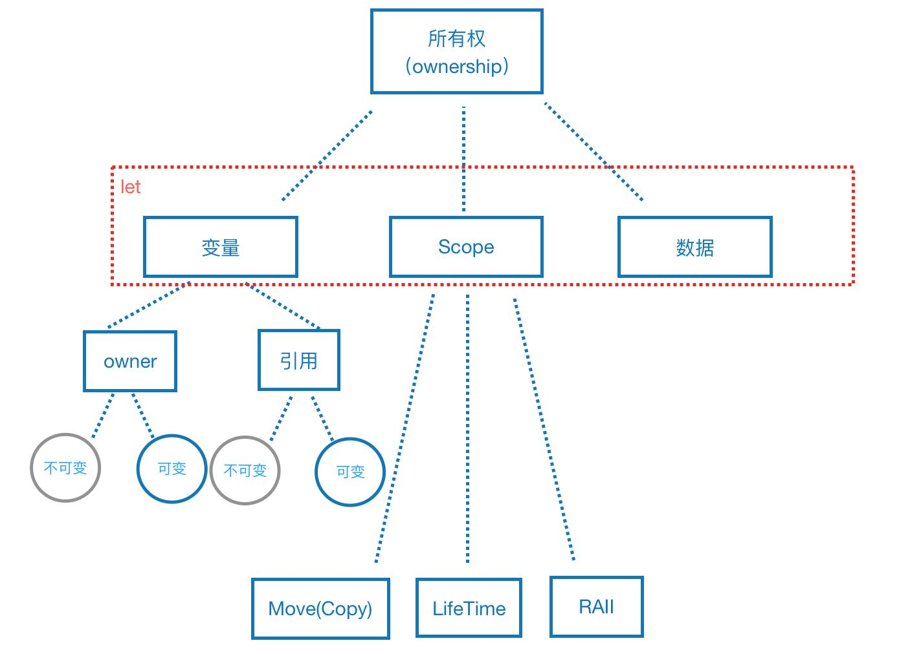

# 所有权（ownership）

## 概述

所有权，顾名思义，至少应该包含两个对象：“所有者”和“所有物”。在Rust中，“所有者”就是变量，“所有物”是数据，抽象来说，就是指某一片内存。

Rust自己的内存管理规则，叫做所有权`Ownership`。



### 所有权规则

> Rust 中的每一个值都有一个被称为其 **所有者**（*owner*）的变量。

> 值在任一时刻有且只有一个所有者。

> 当所有者（变量）离开作用域，这个值将被丢弃。

## 变量的作用域

变量在程序中的生效范围，就是变量的作用域。

变量从声明的位置开始直到当前作用域结束都是有效的。

```rust
fn main() {
    {                      // s 在这里无效, 它尚未声明
        let s = "hello";   // 从此处起，s 开始有效

        // 使用 s
    }                      // 此作用域已结束，s 不再有效
}
```

## 所有权转移

Rust 语言中转让所有权的方式有以下几种：

- 把一个**变量赋值**给另一个变量。
- 把变量传递给函数作为**参数**。
- 函数中返回一个变量作为**返回值**。

### 一个变量赋值给另一个变量

#### 基本数据类型

基本数据类型指的是：整型、浮点型、布尔型、字符、元组 这些大小和长度固定的数据类型。这些数据类型都是存在**栈**中。

所有的基本数据类型，把一个变量赋值给另一个变量，并不是所有权转让，而是把数据**复制**给另一个对象。简单的说，就是在内存上重新开辟一个区域，存储复制来的数据，然后把新的变量指向它。

```rust
fn main(){
   let u1 = 10;
   let u2 = u1;  // u1 只是将数据拷贝给 u2

   println!("u1 = {}",u1);// u1 = 10
}
```

像整型这样的在编译时已知大小的类型被整个存储在栈上，所以拷贝其实际的值是快速的。这意味着没有理由在创建变量 `y` 后使 `x` 无效。

Rust 有一个叫做 `Copy` trait 的特殊标注，可以用在类似整型这样的存储在栈上的类型上。如果一个类型实现了 `Copy` trait，那么一个旧的变量在将其赋值给其他变量后仍然可用。Rust 不允许自身或其任何部分实现了 `Drop` trait 的类型使用 `Copy` trait。

任何一组简单标量值的组合都可以实现 `Copy`，任何不需要分配内存或某种形式资源的类型都可以实现 `Copy` 。如下是一些 `Copy` 的类型：

- 所有整数类型，比如 `u32`。
- 布尔类型，`bool`，它的值是 `true` 和 `false`。
- 所有浮点数类型，比如 `f64`。
- 字符类型，`char`。
- 元组，当且仅当其包含的类型也都实现 `Copy` 的时候。比如，`(i32, i32)` 实现了 `Copy`，但 `(i32, String)` 就没有。

#### 复杂数据类型

这里用String作为例子。

使用String::from创建的，是在**堆**上分配内存，并且是可以改变的。

```rust
fn main() {
    let s1 = String::from("hello");
    let s2 = s1;

    println!("{}, world!", s1);// error：value borrowed here after move
}
```

`String` 由三部分组成，如图左侧所示：一个指向存放字符串内容内存的指针，一个长度，和一个容量。这一组数据存储在**栈**上。右侧则是**堆**上存放内容的内存部分。

> 长度表示 `String` 的内容当前使用了多少字节的内存。容量是 `String` 从分配器总共获取了多少字节的内存。

将值 `"hello"` 绑定给 `s1` 的 `String` 在内存中的表现形式

当我们将 `s1` 赋值给 `s2`，`String` 的数据被复制了，这意味着我们从栈上拷贝了它的指针、长度和容量。我们并没有复制指针指向的堆上数据。不过因为 Rust 同时使第一个变量无效了，这个操作被称为 **移动**（*move*）。

`s1` 无效之后的内存表现

在 `let s2 = s1` 之后，Rust 认为 `s1` 不再有效，因此 Rust 不需要在 `s1` 离开作用域后清理任何东西。看看在 `s2` 被创建之后尝试使用 `s1` 会发生什么；这段代码不能运行。

### 变量传递给函数作为参数

将堆中的对象传递给闭包或函数时，值的所有权也会发生变更。

将值传递给函数在语义上与给变量赋值相似。向函数传递值可能会移动或者复制，就像赋值语句一样。

```rust
fn main() {
    let s = String::from("hello");  // s 作用域开始

    takes_ownership(s);             // s's 的值进入函数
                                    // ... s在这里已经无效

} // s在这之前已经失效
fn takes_ownership(some_string: String) { // some_string 作用域开始
    println!("{}", some_string);
} // some_string 超出作用域并调用了drop函数
  // 内存被释放
```

### 函数中返回变量作为返回值

返回值也可以转移所有权。

```rust
fn main() {
  let s1 = gives_ownership();         // gives_ownership 将返回值
                                      // 移给 s1

  let s2 = String::from("hello");     // s2 进入作用域

  let s3 = takes_and_gives_back(s2);  // s2 被移动到
                                      // takes_and_gives_back 中,
                                      // 它也将返回值移给 s3
} // 这里, s3 移出作用域并被丢弃。s2 也移出作用域，但已被移走，
  // 所以什么也不会发生。s1 移出作用域并被丢弃

fn gives_ownership() -> String {           // gives_ownership 将返回值移动给
                                           // 调用它的函数

  let some_string = String::from("yours"); // some_string 进入作用域

  some_string                              // 返回 some_string 并移出给调用的函数
}

// takes_and_gives_back 将传入字符串并返回该值
fn takes_and_gives_back(a_string: String) -> String { // a_string 进入作用域

  a_string  // 返回 a_string 并移出给调用的函数
}
```

变量的所有权总是遵循相同的模式：

> 将值赋给另一个变量时移动它。当持有堆中数据值的变量离开作用域时，其值将通过 `drop` 被清理掉，除非数据被移动为另一个变量所有。

在每一个函数中都获取所有权并接着返回所有权有些啰嗦。Rust 对此提供了一个功能，叫做 [**引用**（*references*）](/syntax_base/ownership/references)。

## 数据克隆

如果你确实需要深度拷贝，即复制堆内存中的数据。Rust也可以做到，它提供了一个公共方法叫做clone。

```rust
fn main() {
    let s1 = String::from("hello");
    let s2 = s1.clone();

    println!("s1 = {}, s2 = {}", s1, s2);
}
```

clone的方法执行后，内存结构如下图：


## 总结

> 所有权只会发生在堆上分配的数据，对比 C++，可以说所有权只会发生在指针上。

> 基本类型的存储都在栈上，因此没有所有权的概念。

