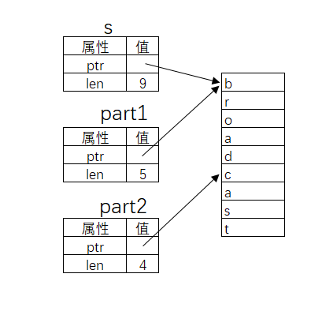

# 切片（slice）

## 概述

切片（Slice）是对数据值的部分引用。

> 切片引用连续的内存分配, 而不是整个集合。

> 它允许安全, 有效地访问阵列而无需复制。

>切片不是直接创建的，而是从现有变量创建的。

>切片由长度组成，并且可以是可变的或不可变的。

> 切片的行为仅类似于数组。

## 字符串切片

**字符串 slice**（*string slice*）是 `String` 中一部分值的引用。

```rust
fn main() {
   let s = String::from("broadcast");
   let part1 = &s[0..5];
   let part2 = &s[5..9];
   println!("{}={}+{}", s, part1, part2);
}
```

字符串切片的原理



使用 `..`表示范围，`x..y` 表示 [x, y) 的数学含义。`..`两边可以没有运算数：

1. `..y` 等价于 `0..y`
2. `x..`等价于位置 `x`到数据结束
3. `..` 等价于位置 `0` 到结束

> 字符串 slice range 的索引必须位于有效的 `UTF-8` 字符边界内，如果尝试从一个多字节字符的中间位置创建字符串 slice，则程序将会因错误而退出。

### 尽量不要在字符串中使用非英文字符

**例如：**中文字符串切片

```rust
fn main() {
   let s = String::from("我就是试试");
   let part1 = &s[0..5];
   let part2 = &s[5..9];
   let len = s.len();
   println!("{}={}+{},len={}", s, part1, part2, len);
}
```

运行会报错：

```shell
thread 'main' panicked at 'byte index 5 is not a char boundary; it is inside '就' (bytes 3..6) of `我就是试试`', src\main.rs:3:17
note: run with `RUST_BACKTRACE=1` environment variable to display a backtrace
error: process didn't exit successfully: `target\debug\my_test.exe` (exit code: 101)
```

> 似乎一个中文占3个字节的位置，所以，如果索引正好将一个完整的中文分割了的话，就会出现错误。

修改一下索引就好了：

```rust
fn main() {
   let s = String::from("我就是试试");
   let part1 = &s[0..6];
   let part2 = &s[6..];
   let len = s.len();
   println!("{}={}+{},len={}", s, part1, part2, len);//我就是试试=我就+是试试,len=15
}
```

### 被切片引用的字符串禁止更改其值

```rust
fn first_word(s: &String) -> &str {
    let bytes = s.as_bytes();

    for (i, &item) in bytes.iter().enumerate() {
        if item == b' ' {
            return &s[0..i];
        }
    }

    &s[..]
}

fn main() {
    let mut s = String::from("hello world");

    let word = first_word(&s);

    s.clear(); // error!

    println!("the first word is: {}", word);
}
```

当拥有某值的不可变引用时，就不能再获取一个可变引用。

因为 `clear` 需要清空 `String`，它尝试获取一个可变引用。在调用 `clear` 之后的 `println!` 使用了 `word` 中的引用，所以这个不可变的引用在此时必须仍然有效。Rust 不允许 `clear` 中的可变引用和 `word` 中的不可变引用同时存在，因此编译失败。

### 字符串字面量就是 slice

```rust
#![allow(unused)]
fn main() {
	let s = "Hello, world!";
}
```

这里 `s` 的类型是 `&str`：它是一个指向二进制程序特定位置的 slice。这也就是为什么字符串字面量是不可变的；`&str` 是一个不可变引用。

在 Rust 中有两种常用的字符串类型：`str` 和 `String`。`str` 是 Rust 核心语言类型，就是本章一直在讲的字符串切片（String Slice），常常以引用的形式出现（`&st`r）。

凡是用双引号包括的字符串常量整体的类型性质都是 `&str`：

```RUST
let s = "hello";
```

这里的 s 就是一个 `&str`类型的变量。

`String`和 `str` 都支持切片，切片的结果是 `&str` 类型的数据。

注意：切片结果必须是引用类型，但开发者必须自己明示这一点:

```rust
let slice =&s[0..3];
```

**`String` `&str` 和 `char`**

```rust
let s = "hello";//--&str
let t = 't';//--char;  必须是一个字符，而且必须是单引号
let mut s = String::from("hello world");//--String
```

### 字符串 slice 作为参数

定义一个获取字符串 slice 而不是 `String` 引用的函数使得我们的 API 更加通用并且不会丢失任何功能：

```rust
fn first_word(s: &str) -> &str {
    let bytes = s.as_bytes();

    for (i, &item) in bytes.iter().enumerate() {
        if item == b' ' {
            return &s[0..i];
        }
    }

    &s[..]
}

fn main() {
    let my_string = String::from("hello world");

    // `first_word` 接受 `String` 的切片，无论是部分还是全部
    let word = first_word(&my_string[0..6]);
    let word = first_word(&my_string[..]);
    // `first_word` 也接受 `String` 的引用，
    // 这等同于 `String` 的全部切片
    let word = first_word(&my_string);

    let my_string_literal = "hello world";

    // `first_word` 接受字符串字面量的切片，无论是部分还是全部
    let word = first_word(&my_string_literal[0..6]);
    let word = first_word(&my_string_literal[..]);

    // 因为字符串字面值**就是**字符串 slice，
    // 这样写也可以，即不使用 slice 语法！
    let word = first_word(my_string_literal);
}
```

## 非字符串切片

除了字符串以外，其他一些线性数据结构也支持切片操作，例如数组：

```rust
#![allow(unused)]
fn main() {
   let a = [1, 2, 3, 4, 5];

   let slice = &a[1..3];
}
```

这个 slice 的类型是 `&[i32]`。它跟字符串 slice 的工作方式一样，通过存储第一个集合元素的引用和一个集合总长度。你可以对其他所有集合使用这类 slice。